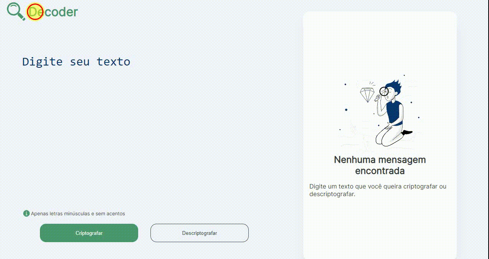

&#xa0;

<h1 align='center'>Decoder</h1>

<!--  -->

<!--  -->

<!--  -->

<a href='#dart-sobre'>Sobre</a> &#xa0; | &#xa0;
<a href='#sparkles-funcionalidades'>Funcionalidades</a> &#xa0; | &#xa0;
<a href='#memo-licença'>Licença</a> &#xa0; | &#xa0;
<a href='https://github.com/fransilva0' target='_blank'>Autor</a>

 

## :dart: Sobre ##

  O projeto é um desafio do Programa ONE, turma 3, da Oracle + Alura, onde a missão
  seria construir uma aplicação que codifica-se e decodifica-se um texto.
  Inicialmente construí os elementos do HTMl e estilizei no CSS de forma a ficarem
  responsivos no mobile, obtendo um front-end para a tela móvel. Após isso,
  utilizando o media query, tornei a tela responsiva para as demais resolusões. Além
  disso, para telas grandes existe um ícone em SVG na área de output que só pode ser
  visto nessa tela, algo apresentado no figma do desafio e que não houve muita
  dificuldade para resolver.

  Seguindo para as funcionalidades do projeto: a primeira, por meio de uma função, captura o texto do input, cria um ArrayList com cada caractere numa
  posição. Depois disso, substitui as letras da mensagem por outras de acordo com a
  criptografia de desafio e envia o novo texto para o local de output.

  A próxima funcionalidade construída no projeto foi a função de desencriptar o texto do usuário. Nesse ponto optei por pegar o texto do input e utilizar o replace() para percorer a string e modificar o texto passando o resultado para o output. Além disso, modifiquei as cores dos elementos da tela e adicionei animações simples em CSS, que não foram planejadas no desafio.

  Em relação as animações, adicionei uma animação onde o ícone e o título do Header percorre uma linha da ponta direita para a esquerda ao iniciar a página. Já nos botões de Encriptar e Desencriptar adicionei uma animação que ao colocar o mouse por cima do mesmo, uma faixa de cor mais escura percorre o botão da esquerda para a direita preenchendo o mesmo com a nova cor. Ambas as animações foram simplistas, apenas para treinamento inicial desse conteúdo.

  Além do desafio principal, ocorreu a sugestão de uma implementação extra no projeto, o botão de copiar o resultado para a área de transeferência, porém não consegui resolve-lo usando o que foi proposto, decidindo, no momento, entregar o desafio apenas com as implementações obrigatórias deixando novas implementações e funcionalidades para algum momento futuro, após a conclusão do programa ONE.

## :sparkles: Funcionalidades ##

:heavy_check_mark: Criptografar texto; 
:heavy_check_mark: Desciptografar texto; 

## :memo: Licença ##

Este projeto está sob licença MIT. Veja o arquivo [LICENSE](LICENSE.md) para mais detalhes.

Feito com :heart: por <a href='https://github.com/fransilva0' target='_blank'>Francileudo Oliveira</a>

&#xa0;

<a href='#top'>Voltar para o topo</a>
